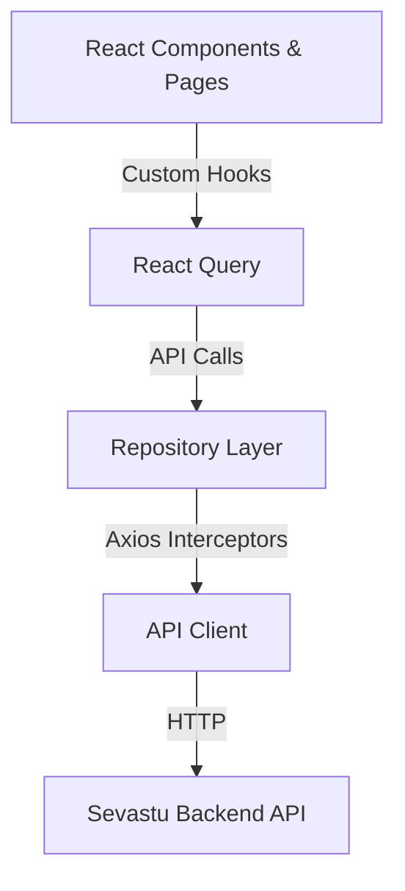

# Sevastu BO V2 - Architecture & Developer Guide

Welcome to the Sevastu Back Office V2! This document serves as the central hub for understanding the system architecture, component structures, data flow, and deployment strategies for the enterprise-ready application.

## 1. System Architecture

Sevastu BO V2 follows a highly modular, feature-based architecture pattern built on **Next.js 16 (App Router)** and **React 19**. 

### High-Level Flow


## 2. Folder Structure

The repository is organized by domain features rather than file types. This ensures scalability and prevents "module bloat."

```text
src/
├── app/                  # Next.js App Router (Pages, Layouts, Error boundaries)
├── components/           # Shared & Global UI components
│   ├── charts/           # Reusable Recharts implementations
│   ├── common/           # Generic buttons, tables, badges
│   ├── error/            # Global & Page Error Boundaries
│   ├── layout/           # AppLayout, Sidebar, Headers
│   └── ui/               # Shadcn UI primitives
├── features/             # Domain-specific modules (The Core)
│   ├── analytics/        # Executive Dashboard & Business Intelligence
│   ├── fulfillment/      # Worker dispatch & assignment logic
│   ├── jobs/             # Job lifecycle management
│   ├── catalog/          # Service & category management
│   └── workers/          # Worker profiles & reviews
├── hooks/                # Global React hooks (e.g., useAuthGuard)
├── lib/                  # Utilities (logger, observability, api client)
└── types/                # Global shared TypeScript definitions
```

### Anatomy of a Feature Module
Each folder in `src/features/` adheres to a strict internal structure:
- `api/`: Axios functions bridging to the backend.
- `components/`: UI components exclusively used by this domain.
- `hooks/`: React Query hooks (`useQuery`, `useMutation`) for this domain.
- `types/`: Domain-specific TypeScript interfaces.
- `repositories/`: (Optional) Abstraction layer parsing API data into business models.

## 3. Data Fetching & State Management (React Query)

We use **TanStack React Query** for all server state. We strictly prohibit storing server data in Redux or Context API.

### Flow & Best Practices
1. **Query Keys**: Defined centrally inside the hook file (e.g., `analyticsKeys.kpis(filter)`). This prevents cache collisions.
2. **Stale Time**: Configured aggressively (1-5 minutes) to prevent over-fetching while maintaining responsiveness.
3. **Mutations**: Always invalidate associated query keys `onSuccess`.

```typescript
// Example: src/features/jobs/hooks/useJobs.ts
export const useJobs = (status) => {
  return useQuery({
    queryKey: ['jobs', status],
    queryFn: () => JobApi.fetchJobs(status),
    staleTime: 60 * 1000, // 1 minute
  });
};
```

## 4. Error Handling & Resilience

Sevastu BO V2 handles errors at three distinct levels:

1. **API Interceptor Level**: `src/lib/apiClient.ts` globally catches 401s (logging out the user) and logs 500s/Timeouts using the centralized logger.
2. **Page/Component Level**: `<PageErrorBoundary>` wraps specific sections (like a dashboard panel) so a failure in one chart doesn't crash the entire page.
3. **Application Level**: Next.js `error.tsx` and `<GlobalErrorBoundary>` catch catastrophic failures and provide a safe fallback UI.

## 5. Observability & Logging

Direct `console.log()` usage is strongly discouraged in production.

- Use **`import { logger } from '@/lib/logger'`** for all logging needs.
- The logger automatically strips `.info()` and `.debug()` in production unless `NEXT_PUBLIC_DEBUG_LOGS=true`.
- **`src/lib/observability.ts`** is prepared with stubs for Sentry and OpenTelemetry tracing.

## 6. Performance & Optimization

- **Lazy Loading**: Heavy libraries like `recharts` are dynamically imported using `next/dynamic` (e.g., in `ExecutiveDashboard.tsx`).
- **Memoization**: Pure UI components (like `KPICard`) are wrapped in `React.memo` to prevent unnecessary re-renders during state updates.

## 7. Future Roadmap

- **Phase 1**: Enable Sentry Error Tracking in `observability.ts`.
- **Phase 2**: Switch Mock API adapters to Live Endpoints for Analytics.
- **Phase 3**: Implement WebSockets for the `LiveActivity` feed instead of polling.
